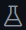

# InterviewChallenges
An assortment of questions, challenges, and problems for interviewing potential Klexos candidates

## How to use

This repo serves as a template for a fully configured development environment within which you will have everything needed to solve the given problems.

To begin, click the green 'Use This Template'  button on the repo's page. In the dropdown click 'Open in a codespace' . This wil open an instance of VisualStudio Code in your browser called a Github Codespace. You will have access to a full IDE, with a directory browser and an Ubuntu terminal available pre-configured with the necessary dependencies and files. Even once the IDE opens, you will need to wait for a terminal to pop open and install the python packages that are required  Once this process finishes you are ready to begin the challenges in the src directory. Each file in src has a few empty functions with docstrings detailing what to do.

## How to submit

Once you have completed the challenges, open the git panel on the left and commit your changes  After committing, click publish branch  You will get a new prompt asing you to name the repo  This repo will be made on your github account, so feel free to make it private. Once published you can click on the  open in github popup to be bought to the repository. Share the repository with the Klexos team and you are all set. Once we are done evaluating your responses you can safely remove the repo.

## Expectations

There are four .py files within the src directory, each with its own instructions as a multiline comment at the beginning of the file. Follow these instructions to complete the challenge in each file. Based on the position you are interviewing for, you will receive a subset of these that you are expected to complete. If you are stumped, leave any partially completed work and add comments detailing how you got to the partial solution, and any additional details you think are relevant. 

<!-- Some automated tests are included to help you know if your provided solution returns an expected result. These can be run in this Codespace environment using the  flask icon in the leftmost bar. -->